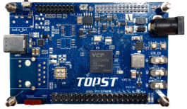

.. _topst_vcp45:

TOPST_VCP45
###################

Overview
********

The TOPST_VCP45 is a 32-Bit MCU Board for Real time Applications.

* PL011 UART controller

Hardware
********

- ARM Cortex-R5F Processor
- 4 MB on-chip Flash memory
- 128 KB RAM
- USB Type-C 1ch (UART)
- CAN 3-ch(max 6-ch)
- UART 3-ch(max 6-ch)
- I2C 3-ch(max 6-ch)
- SPI 2-ch(max 5-ch)
- MFIO 3-ch
- I2S 1-ch

Supported Features
==================

The following features are supported:

+------------+------------+-------------------------------------+
| Interface  | Controller | Driver/Component                    |
+============+============+=====================================+
| UART       | on-chip    | serial port-polling;                |
|            |            | serial port-interrupt               |
+------------+------------+-------------------------------------+
| PL011 UART | on-chip    | serial port                         |
+------------+------------+-------------------------------------+

Not all hardware features are supported yet. See `TCC70xx Full Specification`_ for the complete list of hardware features.

The default configuration can be found in
:zephyr_file:`boards/tcc/topst_vcp_45/topst_vcp_45_defconfig`

Connections and IOs
===================

Telechips to provide the schematic for this board.

System Clock
============

Serial Port
===========

Programming and Debugging
*************************

Flashing
========

Debugging
=========

References
**********
